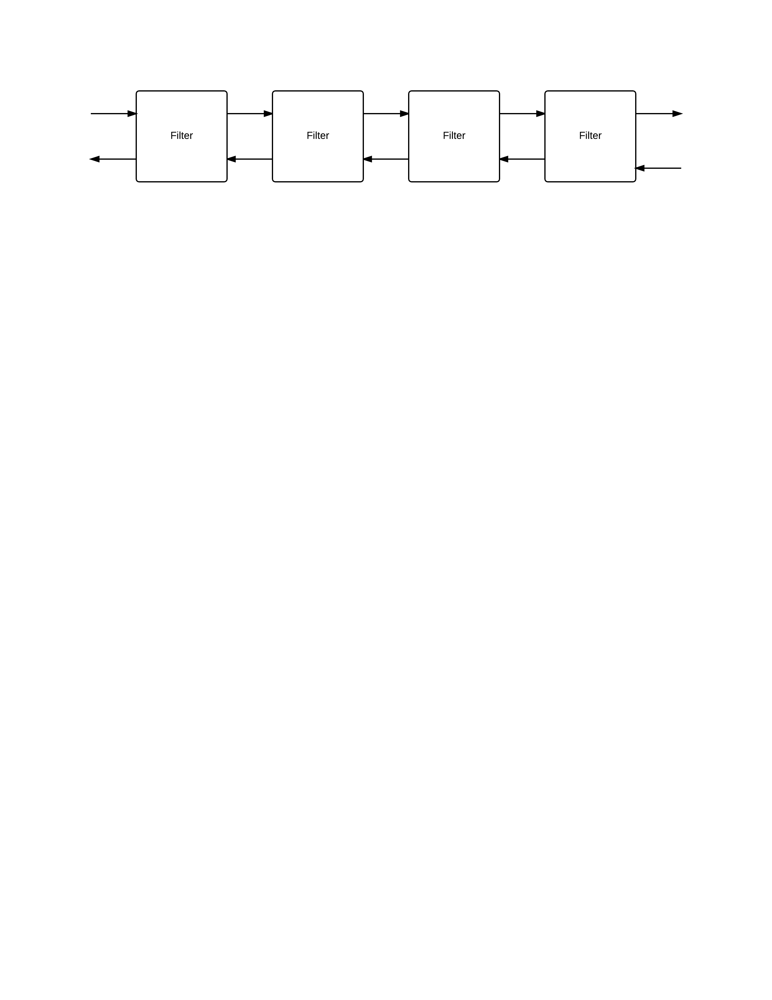

## XAVI - The XTRAC API Platform

### Dependency management

Dependencies are managed via [Godep](https://github.com/tools/godep) Refer to the documentation for how
to manage dependencies, how to preface go commands with godep to pick up stored dependencies, etc.

[This article](http://www.goinggo.net/2013/10/manage-dependencies-with-godep.html) provides a nice overview.

Use godep to build, clean, and test, e.g.

<pre>
godep go build
godep go test ./...
godep go clean
</pre>

To facilitate measuring overall code coverage with gocov, we rewrite the dependencies via godep save -r ./... - note
that the gucumber imports in the internal directy must be reverted to github.com/lsegal/gucumber - if the rewritten
imports are present gucumber panics.

#### Crypto Package

The cryto package has now been vendored via Godeps. The proper path for go get
and vendoring is golang.org/x/crypto/ssh

There are still some hassles with the crypto package, for example a godep restore
fails, complaining about the crypto ssh terminal import path, e.g.

<pre>
godep: unrecognized import path "golang.org/x/crypto/ssh/terminal"
</pre>

### KVStore

XAVI can work with consul as the configuration store, or use a hashmap-based KVStore that can dump and load its
contents to/from a file.

Use the XAVI_KVSTORE_URL environment variable to set the KVStore URL. For consul, the value of the environment
variable should be `consul://host:port` and for a the hashmap/file store specify a file URL for the hashmap backing
file. Note that file URLs are full paths to files, e.g.

<pre>
export XAVI_KVSTORE_URL=file:////Users/***REMOVED***/goprojects/src/github.com/xtracdev/xavi/democfg.xavi
</pre>

### Logging

[Logrus](https://github.com/Sirupsen/logrus) is currently the logging framework. The log level can be set
via the XAVI_LOGGING_LEVEL environment variable (valid values are debug, info, warn, fatal, error, panic).

### Vagrant Image

A vagrant box for the Virtualbox provider is available to team members via the Hashicorp Atlas
repository. Downloading and booting the box provides standard environment components, such as
docker, consul, graphite, statsd, elastisearch, logstash, kibana, fluentd, etc.

The details on how the box was created are available in the [xavi-docker](https://github.com/xtracdev/xavi-docker)
project.

When running xavi locally using services running in the Vagrant box, set environment variables
as needed. Current the consul and statsd directories must be set:

<pre>
export XAVI_CONSUL_AGENT_IP=172.20.20.70
export XAVI_STATSD_ADDRESS=172.20.20.70:8125
</pre>

A pre-built box (private image) is available via Hashicorp Atlas to team members.

### Cross-compiling

For details on cross compiling see https://gist.github.com/d-smith/9d7ca1baa72135dfe7b0

TL;DR

<pre>
GOOS=linux GOARCH=386 CGO_ENABLED=0 godep go build
</pre>

### Consul UI

When running the xavi-docker box, the consul UI is available at http://172.20.20.70:8500/ui/

Note that safari and chrome have trouble accessing this URL as they want to go through the corporate proxy. To
avoid this problem, use Firefox.

To grant access to all virtual boxes that are run with address 172.20.20.XXX, open the Firefox preferences, click
Network under Advanced, click Settings, and add 172.20.20.1/24 to the list of items in No Proxy for, e.g.

<pre>
localhost, 127.0.0.1, 172.20.20.1/24
</pre>

### Go Code Coverage

		godep go test -coverprofile=coverage.out; go tool cover -html=coverage.out
		
#### Go Code Coverage with Gocov

### Port Usage - Mac Os X  

	lsof -n -i4TCP

### Demo Service With Mountebank

We can use [Mountebank](http://www.mbtest.org/) as a service endpoint for trying out XAVI.

Consider the following mountebank imposter definition (see imposter.json):

<pre>
{
  "port": 4545,
  "protocol": "http",
  "stubs": [
    {
      "responses": [
        {
          "is": {
            "statusCode": 400,
            "body": "All work and no play makes Jack a dull boy.\nAll work and no play makes Jack a dull boy.\nAll work and no play makes Jack a dull boy.\nAll work and no play makes Jack a dull boy.\n"
          }
        }
      ],
      "predicates": [
        {
          "equals": {
            "path": "/hello",
            "method": "GET"
          }
        }
      ]
    }
  ]
}
</pre>

We can provide a mock /hello service by defining it using Mountebank:

<pre>
curl -i -X POST -H 'Content-Type: application/json' -d@imposter.json http://127.0.0.1:2525/imposters
</pre>

The service endpoint can be called via curl:

<pre>
MACLB015803:xavi ***REMOVED***$ curl localhost:4545/hello
All work and no play makes Jack a dull boy.
All work and no play makes Jack a dull boy.
All work and no play makes Jack a dull boy.
All work and no play makes Jack a dull boy.
</pre>

We can then set up a simple proxy example like this:

<pre>
export XAVI_KVSTORE_URL=file:////Users/***REMOVED***/goprojects/src/github.com/xtracdev/xavi/mbdemo.xavi
curl -i -X POST -H 'Content-Type: application/json' -d@imposter.json http://127.0.0.1:2525/imposters
./xavi add-server -address localhost -port 4545 -name hello1 -ping-uri /hello
./xavi add-backend -name demo-backend -servers hello1
./xavi add-route -name demo-route -backend demo-backend -base-uri /hello
./xavi add-listener -name demo-listener -routes demo-route
./xavi listen -ln demo-listener -address 0.0.0.0:8080
</pre>

For a two server round-robin proxy config demo, try this:

<pre>
export XAVI_KVSTORE_URL=file:////Users/***REMOVED***/goprojects/src/github.com/xtracdev/xavi/mbdemo.xavi
curl -i -X POST -H 'Content-Type: application/json' -d@hello3000.json http://127.0.0.1:2525/imposters
curl -i -X POST -H 'Content-Type: application/json' -d@hello3100.json http://127.0.0.1:2525/imposters
./xavi add-server -address localhost -port 3000 -name hello1 -ping-uri /hello -health-check http-get
./xavi add-server -address localhost -port 3100 -name hello2 -ping-uri /hello -health-check http-get
./xavi add-backend -name demo-backend -servers hello1,hello2 -load-balancer-policy round-robin
./xavi add-route -name demo-route -backend demo-backend -base-uri /hello
./xavi add-listener -name demo-listener -routes demo-route
./xavi listen -ln demo-listener -address 0.0.0.0:8080
</pre>

For a two server prefer local proxy config, try this:

<pre>
export XAVI_KVSTORE_URL=file:////Users/***REMOVED***/goprojects/src/github.com/xtracdev/xavi/mbdemo.xavi
curl -i -X POST -H 'Content-Type: application/json' -d@hello3000.json http://127.0.0.1:2525/imposters
curl -i -X POST -H 'Content-Type: application/json' -d@hello13100.json http://vc2c09dal2317.***REMOVED***:2525/imposters
./xavi add-server -address `hostname` -port 3000 -name hello1 -ping-uri /hello
./xavi add-server -address vc2c09dal2317.***REMOVED*** -port 13100 -name hello2 -ping-uri /hello
./xavi add-backend -name demo-backend -servers hello1,hello2 -load-balancer-policy prefer-local
./xavi add-route -name demo-route -backend demo-backend -base-uri /hello
./xavi add-listener -name demo-listener -routes demo-route
./xavi listen -ln demo-listener -address 0.0.0.0:8080
</pre>

### Demo Service Proxy Example Setup

<pre>
./xavi add-server -address localhost -port 3000 -name hello1 -ping-uri /hello
./xavi add-server -address localhost -port 3100 -name hello2 -ping-uri /hello
./xavi add-backend -name demo-backend -servers hello1,hello2
./xavi add-route -name demo-route -backend demo-backend -base-uri /hello
./xavi add-listener -name demo-listener -routes demo-route

demosvc -port 3000&
demosvc -port 3100&

./xavi listen -ln demo-listener -address 0.0.0.0:8080

xavi add-route -name demo-route -backend demo-backend -base-uri /hello -filters logging

curl -v 172.20.20.10:8500/v1/kv/?recurse
</pre>

### Acceptance Testing Setup with Boot2docker

Port forward between the host and the boot2docker guest os
<pre>
VBoxManage controlvm boot2docker-vm natpf1 "standalone-mb,tcp,127.0.0.1,3636,,2626"
VBoxManage controlvm boot2docker-vm natpf1 "cohosted-mb,tcp,127.0.0.1,3535,,2525"
VBoxManage controlvm boot2docker-vm natpf1 "xavi-rest-agent,tcp,127.0.0.1,8080,,8080"
VBoxManage controlvm boot2docker-vm natpf1 "xavi-test-server,tcp,127.0.0.1,9000,,9000"
</pre>

Mountebank docker set up - in docker/mountebank-alpine

Note the above port forwarding - it maps the host os perspective to the guest os
perspective, with docker port forwarding managing the mapping of the guest os to the
container. 

Also note that there is no need to start the containers using docker - the acceptance tests will
check to see if the container is running. If the container is not running, the acceptance test will
create and start it using the docker API. The commands below are provided as documentation of what the
acceptance test code does to run the containers.

<pre>
docker build -t "mb-server-alpine" .
docker run -d -p 2626:2525 --name mountebank --label 'xt-container-type=atest-mb' mb-server-alpine
<pre>

XAVI Docker set up - in docker/xavi

Note that you must first cross-compile xavi for linux and copy it into docker/xavi-alpine before building the image

<pre>
docker build -t "xavi-test-alpine-base" .
docker run -d -p 8080:8080 -p 9000:9000 -p 2525:2525 --name xavi-docker --label 'xt-container-type=atest-xavi' --link mountebank:mbhost xavi-test-alpine-base
</pre>

By default the containers are stopped at the end of each test run, which is best for ensure clean test environments in
a known state, as opposed to containers in indeterminate states, for example if test failures leaves ports tied up,
test configuration that can't be cleaned up, etc.

For the purpose of quickly running tests that are meant to test the introduction of breaking changes, the containers
can be left running if gucumer is executued with the environment variable XT_CLEANUP_CONTAINERS=false, e.g.

<pre>
env XT_CLEANUP_CONTAINERS=false gucumber
</pre>

### Codeship Setup - Copy to S3 Bucket

Test setup: nothing

Test commands

<pre>
go get github.com/tools/godep
godep go test ./...
</pre>

1st deploy
* Custom Script

		godep go build

2nd deploy
* Amazon S3

		access key id, secret access key
		region - us-west-1
		localpath - xavi (go build artifact)
		s3 bucket - ds-codeship
		acl - bucket-owner-full-control

### Register Service - Consul

/v1/agent/service/register
<pre>
{
  "ID": "demo-service-1",
  "Name": "demo-service",
  "Tags": [
    "demosvc",
    "v1"
  ],
  "Address": "172.20.20.70",
  "Port": 3000
}
</pre>

<pre>
{
  "ID": "demo-service-2",
  "Name": "demo-service",
  "Tags": [
    "demosvc",
    "v1"
  ],
  "Address": "172.20.20.70",
  "Port": 3100
}
</pre>

### Register Health Check for Service

/v1/agent/check/register
<pre>
{
  "ID": "demo-service-check-1",
  "service_id": "demo-service-1",
  "service-name":"demo-service",
  "Name": "hello",
  "Notes": "Get /hello",
  "HTTP": "http://172.20.20.70:3000/hello",
  "Interval": "10s"
}
</pre>

<pre>
{
  "ID": "demo-service-check-2",
  "service_id": "demo-service-2",
  "service-name":"demo-service",
  "Name": "hello",
  "Notes": "Get /hello",
  "HTTP": "http://172.20.20.70:3100/hello",
  "Interval": "10s"
}
</pre>

### Registered Service DNS query

    dig @172.20.20.70 -p 8600 demo-service.service.consul SRV
    dig @172.20.20.70 -p 8600 v1.demo-service.service.consul SRV

### Deregister Health Check

	curl http://172.20.20.70:8500/v1/agent/check/deregister/demo-service-check

### Deregister service

	curl http://172.20.20.70:8500/v1/agent/service/deregister/demo-service

### Expvar URI on listener host:port

		/debug/vars

### Log Rotation

In /etc/logrotate.d, sudo vi xavi-demo-svc.log:

		/home/vagrant/xavi-logs/demo.log {
			missingok
			copytruncate
			size 50k
			create 755 vagrant vagrant
			su vagrant vagrant
			rotate 20
		}

Then add an entry in /etc/crontab (sudo vi /etc/crontab)

		30 *	* * * 	root	/usr/sbin/logrotate /etc/logrotate.d/xavi-demo-svc.log

Or, alternatively create a script in /etc/cron.hourly (make sure to chmod +x the script)

		#!/bin/sh
		/usr/sbin/logrotate /etc/logrotate.d/xavi-demo-svc.log

logrotate is fussy about the permissions. I created a umask of 022 in the .vagrant .bashrc

The above assumes writing the stdout to a logfile named xavi-demo-svc.log

		xavi listen -ln demo-listener -address 0.0.0.0:11223 >> xavi-logs/demo.log

Note if you don't 'append' via >> you will not see the file size diminish
on truncation (it will have null bytes prepended to the up to the last write offset).

### Statsd Setup - Ubuntu

		apt-get install nodejs npm  
		sudo apt-get install nodejs npm  
		sudo apt-get install git
		git clone https://github.com/etsy/statsd/
		cd statsd/
		cp exampleConfig.js config.js
		vi config.js
		nodejs stats.js ./config.js

config.js contents:

<pre>
{
graphitePort: 2003
, graphiteHost: "172.20.20.50"
,port: 8125
, backends: [ "./backends/console","./backends/graphite" ]
, debug: true
, dumpMessages: true
}
</pre>

### Graphite Setup

<pre>
    3  apt-get -y update
    4  sudo apt-get -y update
    5  apt-get -y install python-ldap python-cairo python-django python-twisted python-django-tagging python-simplejson python-memcache python-pysqlite2 python-support python-pip gunicorn supervisor nginx-light
    6  sudo apt-get -y install python-ldap python-cairo python-django python-twisted python-django-tagging python-simplejson python-memcache python-pysqlite2 python-support python-pip gunicorn supervisor nginx-light
    7  sudo pip install whisper
    8  sudo pip install --install-option="--prefix=/var/lib/graphite" --install-option="--install-lib=/var/lib/graphite/lib" carbon
    9  sudo pip install --install-option="--prefix=/var/lib/graphite" --install-option="--install-lib=/var/lib/graphite/webapp" graphite-web
   11  sudo apt-get install -y git
   12  git clone https://github.com/nickstenning/docker-graphite
   15  sudo cp docker-graphite/nginx.conf /etc/nginx/nginx.conf
   16  sudo cp docker-graphite/supervisord.conf /etc/supervisor/conf.d/supervisord.conf
   20  cd docker-graphite/
   22  cp ./initial_data.json /var/lib/graphite/webapp/graphite/initial_data.json
   23  sudo cp ./initial_data.json /var/lib/graphite/webapp/graphite/initial_data.json
   24  sudo cp ./local_settings.py /var/lib/graphite/webapp/graphite/local_settings.py
   25  sudo cp ./carbon.conf /var/lib/graphite/conf/carbon.conf
   26  sudo cp ./storage-schemas.conf /var/lib/graphite/conf/storage-schemas.conf
   27  sudo mkdir -p /var/lib/graphite/storage/whisper
   28  sudo touch /var/lib/graphite/storage/graphite.db /var/lib/graphite/storage/index
   29  sudo chown -R www-data /var/lib/graphite/storage
   30  sudo chmod 0775 /var/lib/graphite/storage /var/lib/graphite/storage/whisper
   31  sudo chmod 0664 /var/lib/graphite/storage/graphite.db
   35  cd /var/lib/graphite/webapp/graphite
   37  sudo python manage.py syncdb --noinput
   39  sudo /usr/bin/supervisord
</pre>

/var/lib/graphite/conf/storage-schemas.conf

<pre>
[stats]
pattern = ^stats.*
retentions = 10s:6h,1min:6d,10min:1800d

[carbon]
pattern = ^carbon\..*
retentions = 1m:31d,10m:1y,1h:5y

[default]
pattern = .*
retentions = 10s:8d,1m:31d,10m:1y,1h:5y
</pre>

/var/lib/graphite/conf/storage-aggregation.conf

<pre>
[min]
pattern = \.lower$
xFilesFactor = 0.1
aggregationMethod = min

[max]
pattern = \.upper(_\d+)?$
xFilesFactor = 0.1
aggregationMethod = max

[sum]
pattern = \.sum$
xFilesFactor = 0
aggregationMethod = sum

[count]
pattern = \.count$
xFilesFactor = 0
aggregationMethod = sum

[count_legacy]
pattern = ^stats_counts.*
xFilesFactor = 0
aggregationMethod = sum

[default_average]
pattern = .*
xFilesFactor = 0.3
aggregationMethod = average
</pre>

### First Crack at Plugins

Need more info here, idea is we are applying the pipe and filters pattern on the request prior
to backend service invocation, and on the response prior to writing the response.

#### Current Approach - wrapping HTTP handlers using the http test recorder
to buffer output that needs transformation.

### URLs

Running local xavi with vagrant box services

        Expvars - http://localhost:8080/debug/vars
        Grafite - http://172.20.20.70/
        Consul - http://172.20.20.70:8500/ui/
        Kibana - http://172.20.20.70:8000/
