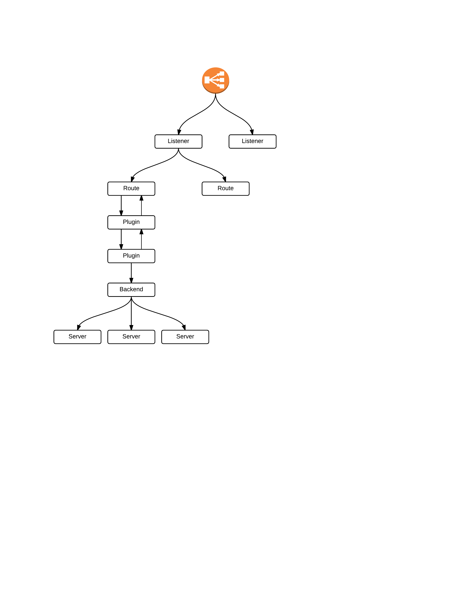
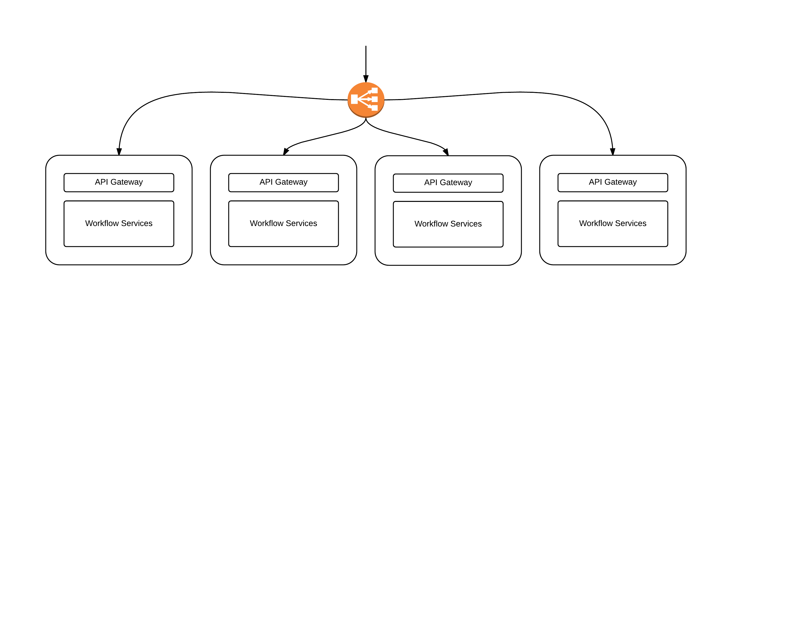
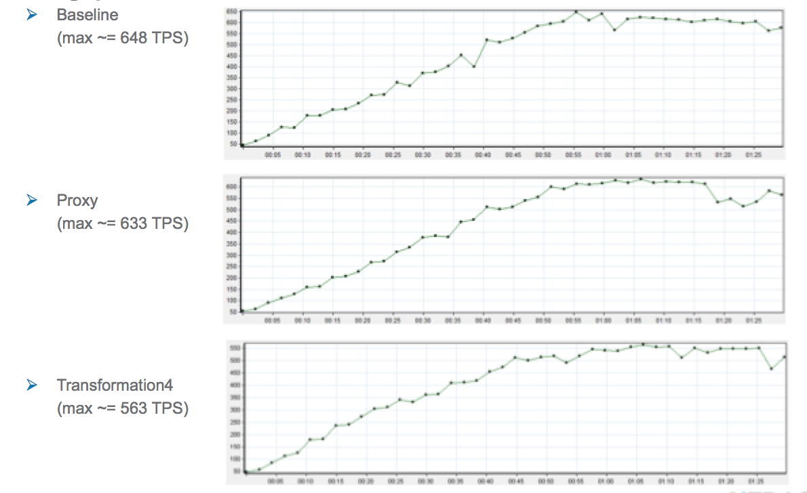
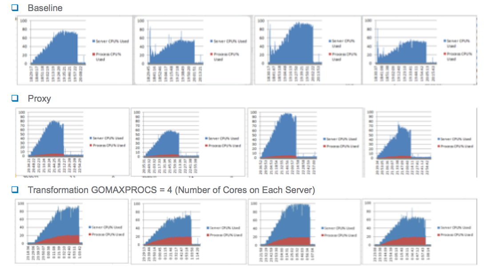
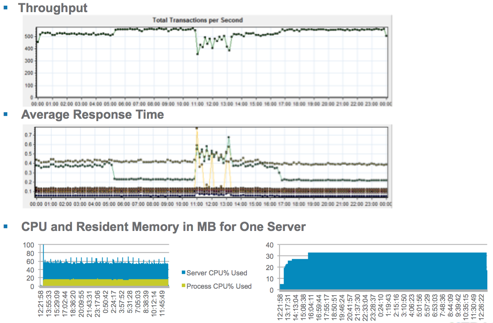

## XTRAC API Gateway

### Introduction and Overview

This document provides an architectural overview of Xavi, the XTRAC API Gateway.
The API gateway is a software layer that decouples API consumers from the systems
that provide the underlying capabilities of the APIs, and allow an API contract
to be defined and maintained from the consumer
perspective, implemented as a facade in front of the services and applications
providing API functionality.

### Context

The following figure shows API clients, the XTRAC API Gateway, and systems that
provide the services underlying the APIs.

The XTRAC API Gateway connects clients to service providers through transforming
middleware that provides an idealized API on top of legacy services.

While originating from the XTRAC organization, there is nothing specific to XTRAC in the design of the gateway - it can be used to decouple any API consumer from any
API producer.

So why build an API Gateway instead of buying a gateway or API management platform?

* Building an API gateway allows us to create a gateway with a tight, well
defined feature set. Designed correctly, we can enable additional functionality
around a tight core through well defined extension points.
* Building an API Gateway in Go Lang that can be extended with plugins written
in Go allows a single toolset to be used for all development activities related
to the API gateway, from core functionality to specialized extensions. Furthermore,
a unified configuration management and testing approach can be used for all artifacts
needed to define and expose an API.
* Building an API gateway gives us control over how configuration is defined,
allowing scenarios where configuration used in a controlled production environment
can be kept in source control and validated as part of an API project's
continuous deployment pipeline.
* Building an API Gateway allows us to make design decisions free from
legacy constraints, allowing us to design and build something that can
run both on premise, as well as at scale in the cloud.
* Beyond putting design, architecture, and technology choices in our hands,
building an API gateway allows us to avoid third party licensing costs for
both on premise and SaaS scenarios.
* Building an API gateway allows us to vendor all third party dependencies,
allowing us to manage dependencies and upgrades on our own terms, as well as
to be selective about the libraries and components we choose to use.

### Functional Overview

The XTRAC API Gateway provides the following functionality.

* _HTTP Reverse Proxy._ HTTP endpoints can be exposed by the XTRAC API gateway to
API consumers, with the gateway handling the routing to the servers providing
API services.
* _Load balancing._ The XTRAC API Gateway provides the ability to load balance
among multiple servers providing capabilities used in an API.
* _Plugin Mechanism._ The XTRAC API Gateway provides a well defined plugin interface
that allows implementing the decorator pattern on HTTP calls, enabling things like
message transformation, url rewriting, and protocol translation.
* _Configuration via Command Line and REST Services._ The configuration used
at runtime by the XTRAC API Gateway can be configured both at the command line and
via a REST service API.
* _Pluggable configuration store._ Supported stores currently include Consul and a memory-based store that can be flushed to disk.

### Quality Attribute Requirements

#### Testability

The XTRAC API Gateway must be build to support test activities, specifically
automated testing at the unit, acceptance, and performance levels in a
continuous deployment pipeline.

#### Availability

The API Gateway must support system configurations to provide 99.999% availabilty, including the ability to
dynamically update backend server pools based on health.

#### Maintainability

The code structure and the surrounding coding environment (programming languages, testing frameworks, and tools) must promote the maintainability of the system.

#### Performance and Scalability

The system may add no more than 100ms latency to tier 1
transactions, and no more than 500ms latency to tier 2
transactions.

#### Portability

Developers must be able to work with API Gateway and its development artifacts
on Windows, Mac OS X, and Linux operating systems.

#### Resource Efficiency

An instance of the API Gateway must use less than thirty precent of the CPU
resources on a machine at peak load when co-hosted with an XTRAC workflow system
the gateway is fronting. In this configuration and at this load, it must use
less than 2 GB memory.

#### Resiliency

The API gateway must continue to function correctly under extreme load, handle
failures in back end systems and varying health states of backend systems without
error, and not leak resources over time.

#### Deployability

The API Gateway must support standard deployment mechanisms, and be deployable
via scripts and other automation means without human intervention.

#### Monitoring and Management

The API Gateway must provide operational transparency to enable operations
staff to understand the health of the gateway and its current activity levels.

#### Security

The API Gateway must support secure operations.

### Software Architecture

#### Overview

The following figure shows the main conceptual elements in the design of the API
Gateway.

* Listeners - network addresses to which API traffic may be sent.
* Routes - delegation mechanism for processing based on URI and request properties.
* Plugins - route processing decorators that can be configured into the call chain. Plugins are the
mechanism used to add functionality like message transformation, providing global concerns
like CORS configuration, and so on.
* Backends - backends define pools of server definitions that requests are routed
to, and an associated load balancer policy for distributing the load among the
server.
* Servers - addresses of API producers, with associated health check policies and
details.

Typically, a single operating system process is the container hosting a listener and one or more routes,
with the plugin, backend, and server definitions needed for each route, with the process created by
running the statically linked executable produced by the golang compiler. This was the configuration
used in our initial architecture quality assessment.

Multiple copies of the same executable can be deployed
and run simultaneously, and is the unit of scale for the API gateway -- there is no state sharing
or coordination that occurs among Xavi processes. The process can be gracefully shutdown by sending it a
SIGTERM.

#### Dependency Management

Dependencies are managed using the Godep tool and vendoring all dependencies in the git repository along
with the code written for the API gateway. See [here](https://github.com/tools/godep) for more details on Godep.

#### The Environment

Xavi takes basic configuration from environment variables. Note all environment variables are defined and documented
in the env package.

* XAVI_KVSTORE_URL - used to configure the key value store used for Xavi configuration. This is treated as a backing service
as per the [12 factor app philosophy](http://12factor.net/). Currently two formats are used for the environment variable - consul://host:port
if consul is used, and a standard file URL to indicate an in-memory store is to be used with the specified file as the
backing store.
* XAVI_LOGGING_LEVEL - used to specify a default log level as per [Logrus](https://github.com/Sirupsen/logrus). Valid values
are debug, info, warn, error, fatal, and panic. If performance allows we should run with debug as the default
level.
* XAVI_STATSD_ADDRESS - when monitoring telemetry data with statsd, use this variable to point to the host and
port of the statsd server. If not specified, all statsd operations default to no-ops.
* XAVI_PPROF_ENDPOINT - if this is set to a host:port value, the pprof endpoints are enable on that host:port
combination for profiling the application.

#### Configuration via Command Line and REST

Once xavi (or an xavi-based application) is built via `godep go build`, it can be used from the command line for both
creating and viewing configuration, as well as for long running processes such as the API gateway process or the
REST service handler.

Running it with no arguments shows the current command set:

<pre>
	usage: xavi [--version] [--help] <command> [<args>]

	Available commands are:
	    add-backend        Define a backend as a collection of servers
	    add-listener       Add a listener
	    add-route          Create a route linking a uri pattern to a backend
	    add-server         Add a server definition
	    boot-rest-agent    Boot REST API agent
	    list-backends      List backend definitions
	    list-listeners     List listener definitions
	    list-plugins       List backend definitions
	    list-routes        List route definitions
	    list-servers       List server definitions
	    listen             Listen on an address using a listener definition
	    ping-server        ping a server
</pre>

For each command, additional help details are available.

<pre>
	./xavi add-listener

	Usage: xavi add-listener [options]

	Options:
		-name Listener name
		-routes List of routes, comma separated, no spaces
</pre>

The implementation for each command is the commands package. Note the persistent data definitions associated with
the commands are defined in the config package.

For each command, a REST service that makes the command available via HTTP is provided as well. To
enable the REST services, run an instance of xavi in rest agent mode, e.g.

<pre>
	xavi boot-rest-agent -address 0.0.0.0:5000
</pre>

Once booted, the commands can be accessed via HTTP.

<pre>
	curl localhost:5000/v1/backends/
	[{"Name":"demo-backend-2","ServerNames":["hello2"],"LoadBalancerPolicy":""},{"Name":"demo-backend","ServerNames":["hello1","hello2"],"LoadBalancerPolicy":"round-robin"},{"Name":"demo-backend-1","ServerNames":["hello1"],"LoadBalancerPolicy":""}]
</pre>

The REST service implementations are available in the commands/agent package.

#### Extending the Gateway via Wrapper Plugins

Currently, Go does not support the dynamic loading of code. Given this restriction,
there are three patterns for extending Go programs with plugins.

1. Treat the base functionality as a framework/toolkit/library, and vendor it in as a dependency
in the program that extends the base framework via plugin extension points.
2. Spin up plugins as separate processes, and use IPC mechanisms to flow requests
through the plugin chain.
3. Embed a scripting engine of some sort, and allow extensions to be plugged in
via scripts.

For Xavi, we choose option 1, based on the following:

1. Compiling in all extensions as native code will have the best performance.
2. Writing plugins in Go allows us to reduce the amount of mental context switching  
when working with program code.
3. Writing plugins in Go lets us exploit efficiencies such as having plugin code
be testable using our standard Go test frameworks and tools, allows plugin code
to be subject to test coverage analysis, enables plugin configuration to be
container in our SCM system, and so on.

The plugin package defines interfaces for plugin-related concepts, and provides services for
registering plugins.

Currently, there's a single class of plugin: those that wrap HTTP request handling.

<pre>
	type Wrapper interface {
		Wrap(http.Handler) http.Handler
	}
</pre>

Plugin providers must also provide a way to instantiate the plugin via a factory interface.

<pre>
	type WrapperFactory func() Wrapper
</pre>

The framework provides the `RegisterWrapperFactory` function to allow those writing an application
using  the framework to register plugins by name for reference in route configuration, which is where
plugins are brought into the processing mix.

It is the responsibility of framework users to register the plugins they will reference in their
configuration. The runner package provides an entry point to execution for framework users, and allows a
plugin registration function to the passed as an argument. Framework users should provide a function that
performs plugin registration.

<pre>
	import xaviplugin "github.com/xtracdev/xavi/plugin"

	func registerPlugins() {
		xaviplugin.RegisterWrapperFactory("Logging", logging.NewLoggingWrapper)
		xaviplugin.RegisterWrapperFactory("soapjson", plugin.NewSOAPJSONWrapper)
		xaviplugin.RegisterWrapperFactory("restful", plugin.NewRestfulWrapper)
	}

	func main() {
		args := os.Args[1:]
		runner.Run(args, registerPlugins)
	}
</pre>

#### Load Balancers and Extension Points

Each backend definition has a load balancing policy associated with it that dictates how requests are
allocated among the servers configured for a backend.

Currently, Xavi provides two load balancers: round-robin and prefer-local. The round-robin load balancer distributes calls
to each server in turn. The prefer-local load balancer maintains two pools of servers - those on the same host as the
Xavi process, on those on external hosts. Requests to a backend using a prefer-local load balancing strategy are sent to
the local server in round robin fashion, and are only sent remotely if no healthy local options are available.

Using the same pattern as the plugin extensions, the loadbalancer package defines two interfaces are defined for load balancers and load balancer factories,
and a mechanism for registering load balancer factories are provided. Only registered factories can be referenced in
backend configuration.

<pre>
	type LoadBalancer interface {
		GetConnectAddress() (string, error)
		MarkEndpointDown(string) error
		MarkEndpointUp(string) error
	}

	type LoadBalancerFactory interface {
		NewLoadBalancer(name string, servers []config.ServerConfig) (LoadBalancer, error)
	}

</pre>

Note as part of the load balancer package initialization, the load balancers that are part of the API Gateway core code
are registered.

<pre>
	func init() {
		loadBalancerFactories = make(map[string]LoadBalancerFactory)

		//Round Robin
		var roundRobinFactory LoadBalancerFactory = new(RoundRobinLoadBalancerFactory)
		RegisterLoadBalancer("round-robin", roundRobinFactory)

		//Prefer Local
		var prefefLocalFactory LoadBalancerFactory = new(PreferLocalLoadBalancerFactory)
		RegisterLoadBalancer("prefer-local", prefefLocalFactory)
	}
</pre>

#### Health Checks

Currently, the framework provides two health check options for server addresses: none, and http-get. When none is configured
(the default), server addresses are presumed to be available at all times, which can be leveraged where the server addresses
in the load balancer pools are virtual addresses that might resolve to health-checked physical endpoints.

When http-get is configured, a get is done on the health check uri endpoint at the time interval specified by the
health-check-interval (given in milliseonds), waiting health-check-timeout (milliseconds) for a reply. If a non-OK error
code is returned or the health check times out, the server is marked as down in the load balancer pool.

Note that the health-check-interval defines the period in which an unhealthy server might receive requests and generate
errors to API consumers. The scenario in mind is the server fails immediately after its health check indicated a
healthy server. In this case the server remains in the pool until the end of the health check interval (plus potentially
the timeout interval), after which the unhealthy state would be detected and the server removed from the pool.

#### Testing

Unit tests are written using a combination of the standard golang testing package, supplemented with the
[testify assert](https://github.com/stretchr/testify) package for xUnit test assertions.

Acceptance test scenarios as validated using [gucumber](https://github.com/lsegal/gucumber) framework, which allows
test specifications to be written using [Gherkin](https://github.com/cucumber/cucumber/wiki/Gherkin), and test steps
to be implemented in golang.

Testing the features of the gateway, such as load balancing algorithms, healthchecks, proxying, and so forth requires
multiple servers to be available for testing. To accomplish this, Docker and Mountebank are used. Docker is used to package and deploy multiple containers where Xavi and Mountebank are run, and Mountebank is used as a web-programmable test reflector
that can provide HTTP functionality.

The docker directory in the project contains the Dockerfiles to configure a Mountebank container, and a Mountebank plus Xavi container. The gucumber "Before" hook is used to spin up the Docker containers, and the "After" hook is used to
shut down the containers.

Once containers are up and available for running test, test set up includes making Xavi REST service calls to configure
and spawn API gateway listeners, as well as REST calls to configure test reflectors in Mountebank.

### Infrastructure Architecture

#### Log Processing

As inspired by 12 Factor apps, the application logs are treated as event streams, with log messages structured using
JSON for easier processing via tools like ELK (Elastisearch, Logstash, Kibana).

In terms of log file management, a separation of concerns is leveraged. Application logging is all done to standard out.
When the API gateway is operated in listener mode, the standard out is redirected to a file. The fluentd tool is used to
forward log data to ELK, and the Linux logrotate command is used for logfile rotation.

#### Telemetry Data

The API gateway emits telemetry data over a UDP connection to a statsd server. In addition to that, the golang runtime expvar debug endpoint is also enabled and supported, which can be accessed directly via the standard port, or can be consumed
via standard services like DataDog's expvar support.

#### Profiling

As covered in the Environment section, the golang pprof interface can be enabled via the `XAVI_PPROF_ENDPOINT`, which
allows profiling operations as per the [pprof documentation](https://golang.org/pkg/net/http/pprof/).

#### Deployment Topology

The API Gateway is stateless and is scaled by running more processes. It can scale vertically by running more processes
on a single server, as well as horizontally by deploying the gateway across many servers. Resource utilization on a
single server can be influenced by the GOMAXPROCS environment variable as well.

In the XTRAC context, we can introduce APIs defined by the use of the API gateway and message transformation plugins
with minimal disruption by deploying the API gateway on the same server as the workflow software used as the API
provider, using a prefer-local load balancing strategy from the gateway to the servers associated with the backend.
This topology is shown in the figure below.

### Operation and Support

Design for transparent operations has been a common theme throughout the design of the API gateway, and
has been detailed in several sections in this document. Features related to transparent operations and support
include:

* Command line and REST service interfaces for creating and inspecting Xavi configuration.
* Endpoint health checking
* Software load balancing
* Structured log stream
* Telemetry data via statsd and expvar
* Ability to enable profiling via an environment variable
* Simple deployment via a single statically linked binary file

### Quality Attribute Analysis

#### Testability

* To accommodate automated acceptance testing, the gateway implementation allows programatic configuration
via a REST interfaces, plus the ability to spawn listener processes for a given configuration.
* The project includes Docker configuration and the use of the Docker API to automate container setup and tear down
to support multi-container testing.
* The key value store used to hold configuration is pluggable with an in-memory store, which allows unit tests to be
written without any infrastructure dependencies. In addition, the in-memory store allows the injection of faults
during test scenarios to allow coverage of KV store error handling.
* Project code is structured to support test coverage of 85% or greater.

#### Availability

* API gateway implementation is stateless, allowing multiple servers to be deployed for physical redundancy
when listener addresses are fronted with a load balancer.
* Server pools have integrated health checking, allowing pools to grow and shrink based on the health of backend
servers.

#### Maintainability

* API gateway is written in Golang, which has readability as a major design goal, a simplified feature set, and
a well defined system for code modularity.
* The feature set of the API gateway is small and focused, and is well covered by unit and system-level
acceptance tests that allow change to be made without fear.

#### Performance and Scalability

As part of the architecture PoC phase of the XTRAC API project, a series tests were
run to allow the assessment of the architecture prior to committing to building production code.

In the area of performance and scalability assessment, single and multinode capacity tests were performed, in which load was applied through the API gateway for proxied services to simulate managed consumers of existing services, as well as services where message transformation was applied in both directions.

In these tests, the latency added by the introduction of the API gateway was measured, both for pass through proxying and message transformation cases. For the transformation case, GOMAXPROCS values of 1 and 4 were used.

The tests showed the additional latency introduced by the gateway to be within the performance requirements.

Beyond latency, the test drivers were able to drive the system to the hardware limits of scalability, with the combination
of the gateway and the proxied system (XTRAC workflow) using 100% of the CPU.

#### Portability

Throught the architecure PoC phase, development and testing was done on a variety of operating systems and environments,
including Windows, Mac OS X, and Linux (Ubuntu, Oracle, and CentOS variants).

#### Resource Efficiency

In all cases the CPU usage was under the 30% max CPU budget, with the proxying case using about 8% at max load, and the
transforming case using about 20% at max load.

Memory usage was much smaller than the budget. Given our experience with Java applications, we were hoping to use
less than 2 GB memory. At max load, we came in at roughly 33 MB, almost two orders of magnitude lower than
out budget.

#### Resiliency

To assess resiliency, various failure scenarios for the backends proxied by the API gateway were performed. In all cases the
health was able to detect failed and repair servers, and to keep functioning correctly as servers failed and healed.

Additionally, multinode longevity testing was performed to ensure not resources leaks occurred while running for
extended periods under full load. Longevity testing confirmed the system ran with no resource leaks.

#### Deployability

Deployment consists of copying a single executable to the machines hosting the gateway, and running a shell script to
configure servers, backends, routes, and listeners.

#### Monitoring and Management

Xavi has been successfully integrated with Elasticsearch/Log Stash/Kibana, Statsd, Graphite, and DataDog for both
log analysis and graphing in real time of telemetry data. We will refine this as XTRAC ops provides standard
solutions for log management and telemetry data.

#### Security

The initial architecture has no sensitive data or authentication/authorization functionality, serving as proxying
middleware that can be extended with transforming plugins to provide an idealized interface on top
of existing services. Security concerns of the applications that are proxied by the API Gateway remain the sole
concern of the underlying application.

In terms of secure operation, the production configuration is under the control of the operations team, who
can decide what non-listener ports to enable.

Follow on architecture phases will put more emphasis on security, including secure coding and reviews with security specialists,
use of access tokens for invoking APIs, realtime API activity analytics, and security plugins to do things like apply
WAF security checks and other regular expression based constraints on content passing through the gateway.
